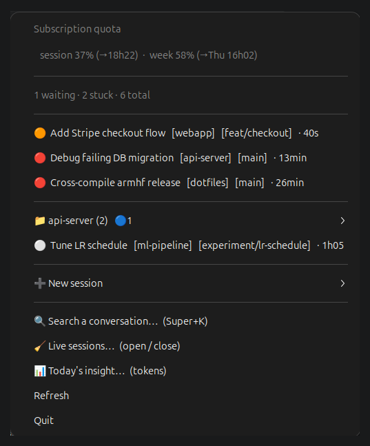
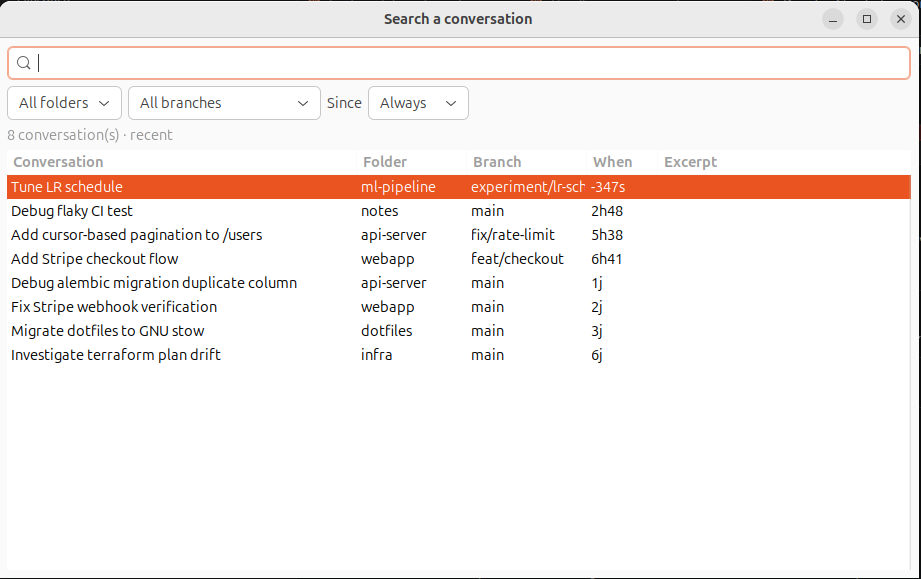
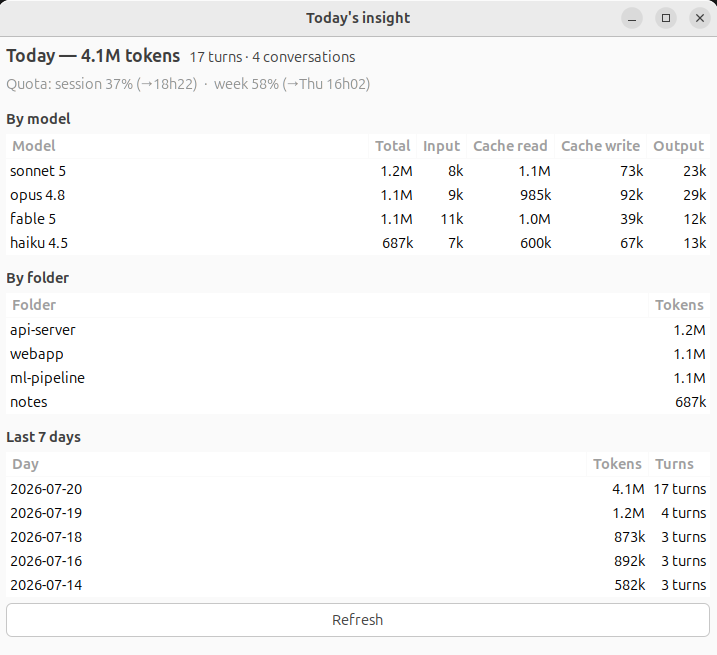
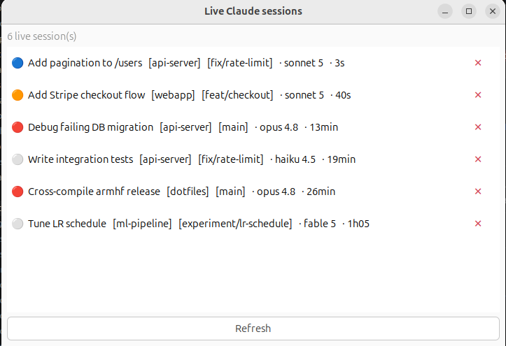
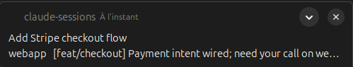

# Claude Sessions Tray

A GNOME panel indicator that lists **all your Claude Code sessions**, across every folder, and highlights the ones waiting for an instruction, so you stop touring your VSCode windows.



- Sessions needing attention flat on top, calm ones grouped by project.
- Status dot: 🔵 working · 🟠 ready · ⚪ idle · 🔴 stuck.
- **Click a session** to open its tab in the right VSCode window, even in the background.
- **🔍 Search** the whole history (full-text), **🧹 Live sessions** (open / close), **📊 Insight** (token usage).
- **Notification** when a session turns ready, and your **subscription quota** in the bar.

## Screenshots

| | |
|---|---|
| Full-text search, with filters | Today's token usage |
|  |  |
| Live sessions (open / close) | Ready notification |
|  |  |

## Why this exists

I run many Claude Code sessions at once, one VSCode window per folder, and kept touring windows to find which one was waiting on me. Nothing centralizes that view:

- **VSCode**: the Claude Code extension is mono-root. A multi-root workspace takes the first folder as the root, so the session list only covers one folder.
- **Zed**: same, the agent is rooted at the first folder.
- **Terminal** (`claude agents`) does list everything, but I prefer VSCode's rendering and opening code straight from the deep links Claude gives me.

`claude agents --json --all` is the one thing that sees every session across folders, so the tray builds on it.

## Why a GNOME extension?

Under Wayland, a background app cannot give focus to another window (protocol security). VSCode's `vscode://` deep link always opens in the already-active window, so clicking a session from another window opened a duplicate.

The `claude-focus@corentin-core.github.io` extension runs *inside* the compositor and exposes a `FocusWindow` DBus method that raises the right VSCode window. The tray calls it before the deep link, so you land on the right window and the right tab. It's best-effort: without the extension, the tray falls back to plain deep-link behavior.

The extension also carries the global shortcut (Super+K): it calls the tray's `io.github.corentin_core.ClaudeTray` service to open the search palette, then raises the window. Same reason, only the compositor can grant focus under Wayland.

## State

State comes from the **last event in the session's transcript**, not from write freshness, so a long-running tool doesn't drop it back to "working":

- last assistant `end_turn` → **ready** (🟠), or **idle** (⚪) if silent > `WAITING_WINDOW`
- last assistant `tool_use`, or your prompt without a reply → **working** (🔵)
- Claude's turn but silent > `STUCK_WINDOW` → **stuck** (🔴), likely a hung tool or a crashed CLI

The live list comes from `claude agents --json --all`. Two sessions with an identical label get a `#handle` suffix to tell them apart.

## Search

Full-text over message **content**, not just titles (SQLite FTS5, accent-insensitive, so `amelior` finds "Améliorations"), plus title / folder / branch / last prompt. Filter by folder, branch, and age; sort any column. Keyboard: **↑/↓** move, **Enter** opens, Esc closes; **Super+K** opens it from anywhere (rebind via GSettings key `toggle-palette`).

Opening a result raises the right folder's window first: reopening a session outside its original folder would yield an empty session.

## Live sessions & insight

**🧹 Live sessions**: the ✕ button sends SIGTERM. If the session still has a VSCode tab, that tab is left as a dead panel to close by hand (no API closes a specific tab).

**📊 Insight**: no `$` figure. A subscription isn't billed per token, so the quota (shown at the top) is the budget that actually matters.

## Notifications

- One per transition to ready; startup and manual refresh don't fire any.
- Skipped if the session's window is already focused (extension's `IsFocused`).
- Disable with `NOTIFY_ON_READY = False`.

## Requirements

| | |
|---|---|
| Desktop | GNOME Shell 46, **Wayland** session |
| Tray | `python3-gi`, `gir1.2-ayatanaappindicator3-0.1`, `gir1.2-gtk-3.0`, `gir1.2-notify-0.7` (preinstalled on Ubuntu GNOME) |
| Bar | AppIndicator extension enabled (`ubuntu-appindicators` on Ubuntu, otherwise `appindicatorsupport@rgcjonas.gmail.com`) |
| Claude | `claude` CLI on the `PATH`, VSCode extension **Anthropic.claude-code** |

The applet runs with `/usr/bin/python3` (the system Python that sees PyGObject), not a venv.

Missing some of these? This is a Claude Code tool, so the quickest fix is to **ask Claude to get the prerequisites in place**. That's the fiddly part; the install itself is one script.

## Installation

```bash
./install.sh
```

Then, once:

1. `gnome-extensions enable claude-focus@corentin-core.github.io`
2. **Log out / log back in**. Wayland only loads a new extension at login.
3. The tray autostarts at later logins. To launch it now:
   ```bash
   setsid /usr/bin/python3 ~/.local/share/claude-sessions/tray.py </dev/null >/dev/null 2>&1 &
   ```

## Settings

At the top of `~/.local/share/claude-sessions/tray.py`:

| Constant | Role | Default |
|---|---|---|
| `WAITING_WINDOW` | inactivity (s) beyond which a ready session turns ⚪ idle | `900` (15 min) |
| `STUCK_WINDOW` | silence (s) on Claude's turn beyond which a session turns 🔴 stuck | `600` |
| `STREAMING_WINDOW` | recent write (s) counted as 🔵 working | `8` |
| `POLL_SECONDS` | refresh period | `4` |
| `NOTIFY_ON_READY` | notify when a session turns 🟠 ready | `True` |
| `USAGE_POLL_SECONDS` | subscription-quota polling period | `180` |
| `PROJECT_SUBMENU_MIN` | calm sessions per folder before it collapses into a submenu | `2` |
| `FOCUS_DELAY` | focus → deep link delay; raise it if a click opens in the wrong window | `0` |
| `TARGET_SESSION_BY_ID` | click targets the session by ID (`True`) or the folder (`False`) | `True` |

## Demo mode

The screenshots run in demo mode, so no real sessions are shown. `CLAUDE_TRAY_FAKE=1` injects fake sessions (menu, panel, notifications, Live sessions):

```bash
CLAUDE_TRAY_FAKE=1 /usr/bin/python3 ~/.local/share/claude-sessions/tray.py
```

Search and Insight read real history, so the repo ships a seed harness that builds a throwaway `HOME` with synthetic transcripts:

```bash
python3 demo/seed_demo.py --run
```

See `demo/` for details.

## Known limitations

- **Wayland**: loading or updating the extension requires a relog.
- **Window raising is best-effort**: the tab is always targeted by session ID (deep link), but bringing its window to the front matches by folder name in the title. If that name isn't in the title, the window may not come forward, though the right tab still opens.

## Uninstall

```bash
gnome-extensions disable claude-focus@corentin-core.github.io
rm -rf ~/.local/share/gnome-shell/extensions/claude-focus@corentin-core.github.io
rm -rf ~/.local/share/claude-sessions
rm -f ~/.config/autostart/claude-sessions-tray.desktop
pkill -f claude-sessions/tray.py || true
```

---

*Fully vibecoded, built end-to-end with [Claude Code](https://claude.com/claude-code).*
